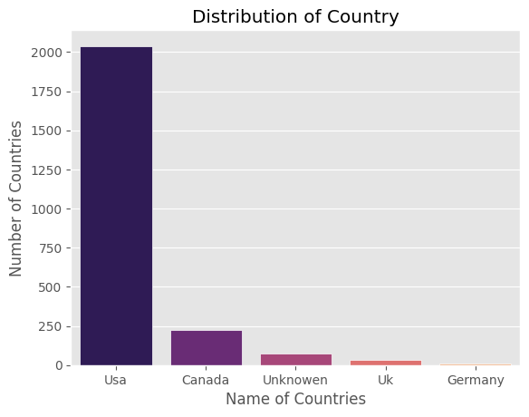
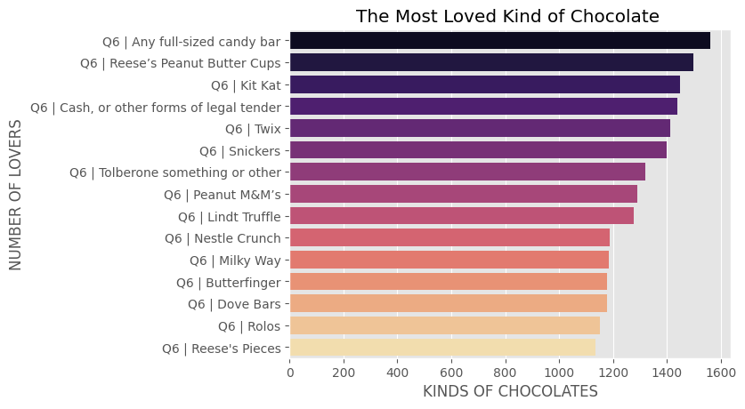

# Candy-Data-Analysis
This project analyzes candy data to understand patterns and insights 
such as popularity, ingredients, and trends using Python and data visualization.
The goal is to practice data analysis skills and visualize results in a clear way.
# Tools Used:
- Python
- Pandas
- Matplotlib
- Seaborn
  # Project Structure:
- dataset file
- Python script for analysis
- visualizations (charts and graphs)
  # Key Insights:
- Identified most popular candy types
- Visualized trends in candy features
- Generated charts to support analysis
  # Images:
  
  
  
