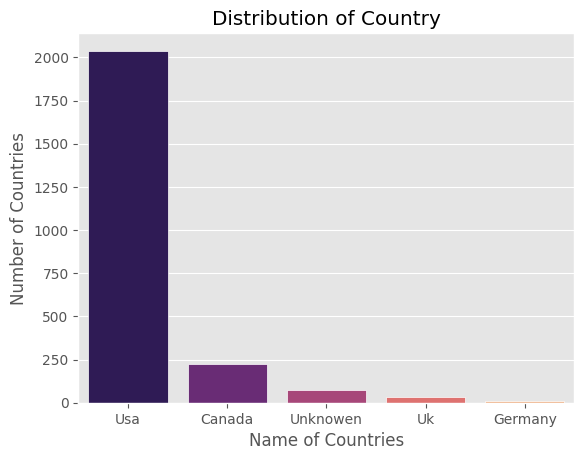
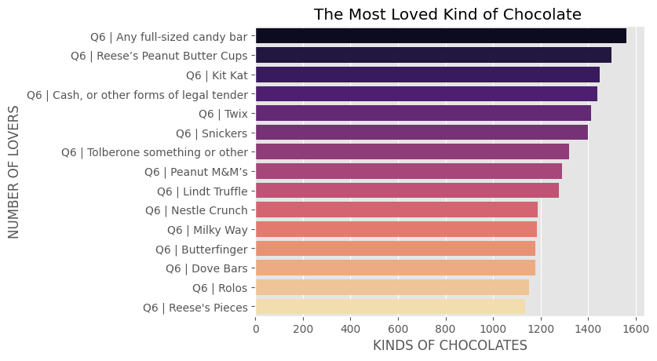
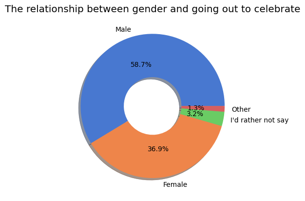
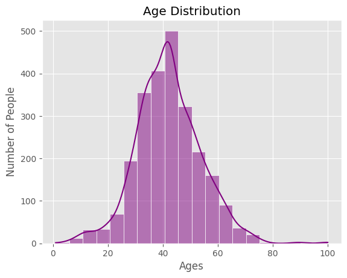
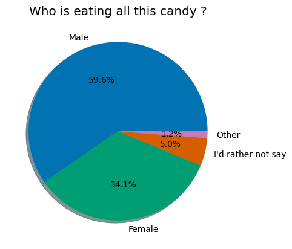

# Candy Data Analysis Project


## Project Overview

This project involves analyzing a dataset related to candy to understand various patterns and insights, such as popularity, ingredients, and market trends. The primary goal is to practice data analysis skills using Python and to visualize the results in a clear and insightful manner.


## Tools & Technologies Used

- **Language:** Python
- 
- **Libraries:** Pandas (Data Manipulation), Matplotlib (Data Visualization), Seaborn (Enhanced Data Visualization).
- 


## Project Structure

- `dataset file`: The raw data used for analysis.
- 
- `Python script for analysis`: Jupyter Notebook or Python script containing the data cleaning, analysis, and visualization code.
- 
- `visualizations`: Charts and graphs generated from the analysis.
- 


## Key Insights & Visualizations


### Most Popular Candy Types

Identified the most popular candy types based on the dataset, revealing consumer preferences and market demand.




### Trends in Candy Features

Visualized trends in various candy features, such as sugar content, ingredients, or other characteristics, to understand their distribution and impact.




### Consumer Preferences (Example: Donation Preferences)

Explored specific consumer preferences, such as how people would prefer to donate candy, providing insights into consumer behavior.




### Distribution of Candy Attributes

Analyzed the distribution of different candy attributes, helping to understand the variety and common characteristics within the dataset.




### Overall Candy Type Distribution

A pie chart illustrating the overall distribution of different candy types in the dataset.




## How to Run This Project Locally


To run this project on your local machine, follow these steps:


1.  **Clone the repository:**
2.  
    ```bash
    
    git clone https://github.com/Mai-star/Candy-Data-Analysis.git
    
    cd Candy-Data-Analysis
    
    ```
    
2.  **Create a virtual environment (recommended):**
3.  
    ```bash
    
    python -m venv venv
    
    source venv/bin/activate  # On Windows use `venv\Scripts\activate`
    
    ```
    
3.  **Install the required libraries:**
4.  
    ```bash
    
    pip install -r requirements.txt
    
    ```
    
4.  **Launch Jupyter Notebook (if applicable):**
5.  
    ```bash
    
    jupyter notebook
    
    ```
    
    Navigate to the analysis notebook (e.g., `Candy-Data-Analysis.ipynb`) and open it.
    


## Conclusion

This project successfully demonstrated a comprehensive data cleaning and exploratory data analysis workflow. The analysis revealed key insights into the candy dataset, providing valuable information on popularity and trends.


## License

This project is licensed under the MIT License - see the [LICENSE](LICENSE) file for deta


